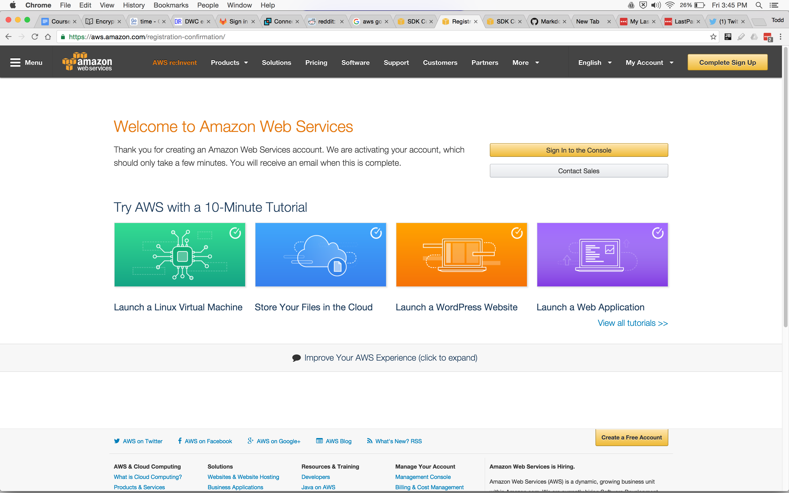

# Go & AWS

## Step #1
[AWS SDK for Go](https://aws.amazon.com/sdk-for-go/)

## Step #Create an AWS Account
- Create account
  - enter credit card info

## Documentation
- [Go on AWS](http://docs.aws.amazon.com/sdk-for-go/v1/developer-guide/welcome.html)
- [API Reference](http://docs.aws.amazon.com/sdk-for-go/api/)

## Step #
go get -u github.com/aws/aws-sdk-go/...

## Step #
Credentials

[best practices](http://docs.aws.amazon.com/general/latest/gr/aws-access-keys-best-practices.html)

# Understanding AWS

Amazon Web Services (AWS)offers a suite of cloud-computing services that make up an on-demand computing platform. These services operate from 14 geographical regions across the world. They include Amazon Elastic Compute Cloud ("EC2") and Amazon Simple Storage Service ("S3"). 

As of 2016 AWS has more than 70 services including compute, storage, networking, database, analytics, application services, deployment, management, mobile, developer tools and tools for the Internet of things. 

Amazon markets AWS as a service to provide large computing capacity quicker and cheaper than building your own physical server farm.

## Services

### EC2 - Elastic Computer Cloud
Amazon Elastic Compute Cloud (EC2) forms a central part of Amazon.com's cloud-computing platform, Amazon Web Services (AWS), by allowing users to **rent virtual computers** on which to run their own computer applications. EC2 encourages scalable deployment of applications by providing a web service through which a user can boot an Amazon Machine Image (AMI) to configure a virtual machine, which Amazon calls an "instance", containing any software desired. A user can create, launch, and terminate server-instances as needed, paying by the hour for active servers – hence the term "elastic". EC2 provides users with control over the geographical location of instances that allows for latency optimization and high levels of redundancy.

### S3 - Simple Storage Service
Amazon S3 provides storage through web services interfaces (REST, SOAP, and BitTorrent). Amazon launched S3 in the United States in March 2006 and in Europe in November 2007.

At its inception, Amazon charged end users US$0.15 per gigabyte/month, with additional charges for bandwidth used sending and receiving data, and a per-request (get or put) charge. On November 1, 2008, pricing moved to tiers where end users storing more than 50 terabytes receive discounted pricing. Amazon says that S3 uses the same scalable storage infrastructure that Amazon.com uses to run its own global e-commerce network.

S3 uses include web hosting, image hosting, and storage for backup systems. 